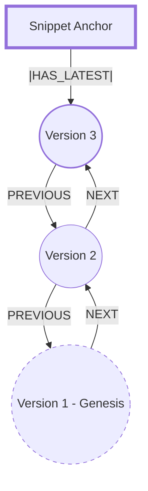

This document will serve as the "Bridge Blueprint." By combining the **Cypher** logic with **Mermaid** visualizations, we create a specification that ensures the Go code we write later is just a mechanical implementation of this design.

`docs/04-graph-mutation-spec`

---

# High-performance **Temporal Navigation Engine**.

---

# **The Bidirectional Temporal Path**

## **1\. Structural Overview**

The graph represents code evolution as a **doubly-linked chain** anchored to a static identity. This topography allows for high-speed traversal in both directions:

* **Backward (`PREVIOUS`):** For rollbacks and historical audits.  
* **Forward (`NEXT`):** For "replaying" code evolution and watching the path unfold.

### **The Entities**

* **`Snippet`**: The static anchor (Identity Shore).  
* **`Version`**: The immutable milestone (Temporal Path).

---

## **2\. Visual Topology (Mermaid)**

The following diagram illustrates the bidirectional flow between the anchor and its evolving milestones.

---

## **4\. Design Reasoning (Spotnet Legacy)**

* **Traversal Efficiency:** Finding "what happened after Version X" in a standard graph requires a broad search. With the `NEXT` relationship, it is a direct pointer lookup (O(1)).  
* **Chain Integrity:** Every version (except Genesis) must have exactly one `PREVIOUS` and one `NEXT` (except for the Latest).  
* **Self-Healing:** If the system detects a `Version` with a `PREVIOUS` but no `NEXT` pointing back to it, we have identified a "Broken Bridge" that needs manual reconciliation.

---

## **5\. Pothole Forecast: The "Split Integrity"**

**The Folly:** Writing code that creates `PREVIOUS` but forgets to create `NEXT`. **The Reality:** This creates a "One-Way Street" where you can roll back, but you can never roll forward again. **The Mitigation:** Use the Go Neo4j Driver's **Transaction API**. The `CREATE` of both relationships must occur within the same `tx.Run()` call to ensure the graph never enters a corrupted state.

---

### **Next Milestone: `internal/core/ports.go`**

With the spec now reflecting the bidirectional topography, we can define the Go interface that will enforce this "Atomic Handshake."

