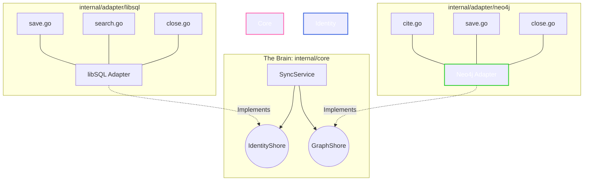

# Project State Document: Day 12 - "Directories of Purpose" & Graceful Teardown

## 🌉 Architecture Overview
* **Pattern:** Strict Hexagonal Architecture (Ports & Adapters).
* **The Brain:** `SnippetService` (`internal/core/services`) remains fully type-safe and isolated.
* **The Shores (Adapters):** Both persistence layers now use a "Directories of Purpose" pattern, shattered into functional, single-purpose files (`save.go`, `close.go`, etc.) within dedicated packages (`libsql` and `neo4j`).
* **Infrastructure:** OS-level signal listening (`SIGINT`, `SIGTERM`) is fully implemented for zero-downtime, graceful database teardowns.

### Current Architectural Topology

✅ Recent System Alignments (Today's Wins)
Symmetrical Directories: Successfully shattered neo4j_adapter.go and libsql_adapter.go into purpose-driven sub-packages.

Interface Pruning: Removed split-brain logic by deleting the redundant CreateSnippet method; the Core now strictly relies on Save for identity persistence.

Graceful Shutdown: Wired the new Close() methods into cmd/server/main.go using a background goroutine and done channel to gracefully catch OS interrupts.

🚧 Immediate Roadmap & Known Technical Debt
Tech Debt (High Priority): internal/adapter/libsql lacks an integration test. We need a libsql_test.go to mirror our Graph Shore's safety net.

Feature Roadmap: HTTP handlers are currently stubbed. They need to be wired to the SyncService with proper JSON payload parsing and error orchestration.

🧭 Development Roadmap for Tomorrow
We will follow strict Red-Green-Refactor TDD for the following steps:

Code snippet
sequenceDiagram
    participant Test as 1. Test Suite (Red/Green)
    participant SQL as 2. libSQL Integration
    participant HTTP as 3. API Handlers
    participant Service as 4. SyncService

    Note over Test,SQL: Sprint 1: Shore Up the SQL Test
    Test->>SQL: Write libsql_test.go (Failing)
    SQL-->>Test: Assert ON CONFLICT logic (Passing)
    
    Note over Test,Service: Sprint 2: The API Wiring
    Test->>HTTP: Write handler_test.go (httptest)
    HTTP->>Service: Decode JSON -> Call Service
    Service-->>HTTP: Return Domain Error or Success
    HTTP-->>Test: Assert 201 Created / 500 Internal Error

***
