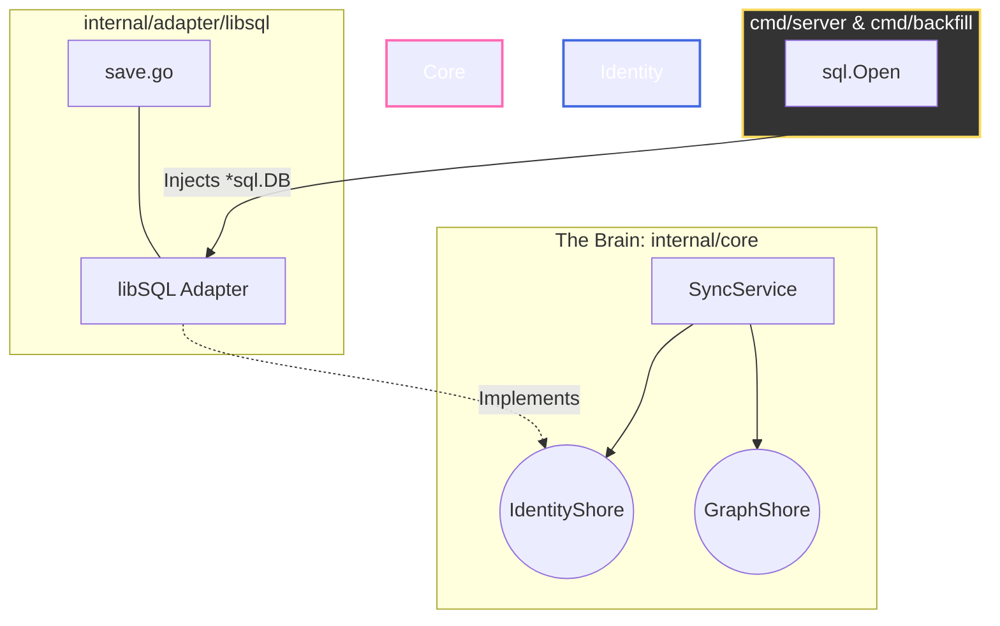

# Project State Document: Day 13 - The Ironclad Identity Shore

## 🌉 Architecture Overview
* **Pattern:** Strict Hexagonal Architecture (Ports & Adapters).
* **The Brain:** `SnippetService` (`internal/core/services`) remains isolated, type-safe, and defines the persistence contracts.
* **The Shores (Adapters):** 
  * `internal/adapter/neo4j` (Graph Shore) 
  * `internal/adapter/libsql` (Identity Shore) - Fully shattered into functional, single-purpose files (`save.go`, `close.go`, etc.).
* **Infrastructure:** OS-level signal listening for zero-downtime, graceful database teardowns. Infrastructure (`cmd/server`, `cmd/backfill`) now strictly owns database connection lifecycles via Dependency Injection.

### Current Architectural Topology

✅ Recent System Alignments (Today's Wins)
Strict Dependency Injection: Refactored NewLibSQLAdapter to accept a pre-opened *sql.DB. The adapter no longer manages connection lifecycles, making it infinitely more testable.

Infrastructure Wiring: Updated cmd/server/main.go and cmd/backfill/main.go to handle database connections and inject them gracefully into the adapter.

TDD Victory (Identity Shore): Wrote a comprehensive libsql_test.go using an in-memory SQLite database.

Bulletproof Upserts: Implemented and proved robust ON CONFLICT logic in save.go using ExecContext, guaranteeing zero row duplication on snippet updates. Test suite executes in a blazing 0.006s.

🚧 Immediate Roadmap & Known Technical Debt
Tech Debt (Domain Logic): Critical TODO: The Core Domain must be the master of time. We need to update SyncService to inject time.Now() into core.Snippet.CreatedAt before passing it to the adapter's Save method.

Sprint 2 (The API Wiring): HTTP handlers are currently stubbed. We need to write handler_test.go (using httptest), wire the handlers to the SyncService, and implement proper JSON payload parsing and error orchestration.

🧭 Development Roadmap for Tomorrow
We will continue our strict TDD loop for the HTTP layer:

Test-First Handlers: Write failing tests using httptest.NewRecorder for our HTTP adapter.

Payload Parsing: Safely decode incoming JSON into our domain structs.

Service Orchestration: Call the SyncService and map domain errors to proper HTTP status codes (201 Created, 500 Internal Error, etc.).